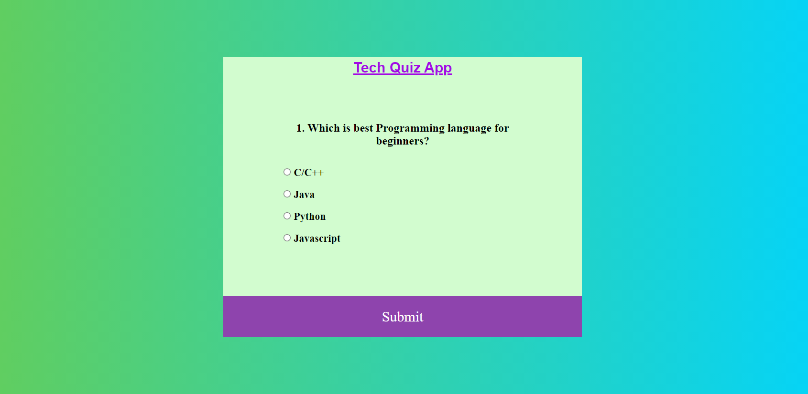

# Tech-Quiz-App

* Skills - HTML, CSS, JavaScript

<div align="center">



</div>

This is a [Tech Quiz App](https://shivam-sharma7.github.io/Tech-Quiz-App/) where you will find question related technologies and computer science. You can chose right answser for every question and see your score! 💯


## Running the App Locally & Contributing 
### To run the Tech Quiz App on your local computer, follow these steps:

1. Fork the repository by clicking the "Fork" button on the top right corner of the repository page.

2. Clone the forked repository to your local computer using the following command:
```
git clone https://github.com/your-username/Tech-Quiz-App.git

```
3. Create a new branch for your changes:
```
git checkout -b my-new-feature
```

4. Make your changes to the code.

5. Commit your changes with a descriptive commit message:
```
git commit -m "Add some feature"
```

6. Push your changes to your forked repository
```
git push -u origin my-new-feature
```
7. Create a pull request by clicking the "Pull Request" button on the repository page.